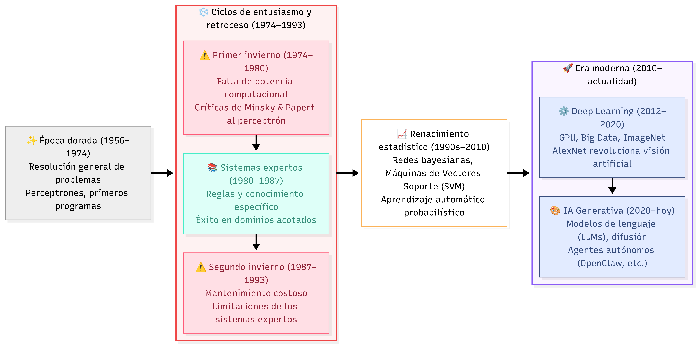
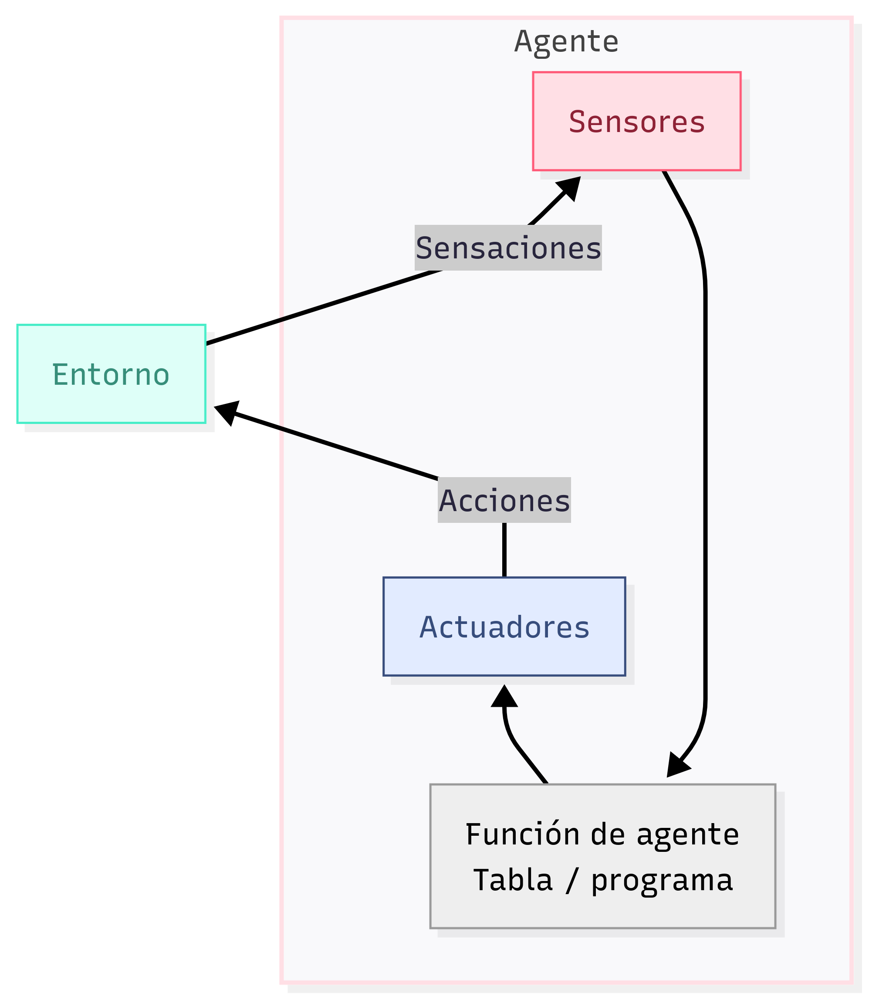
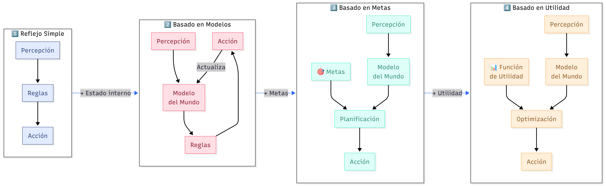
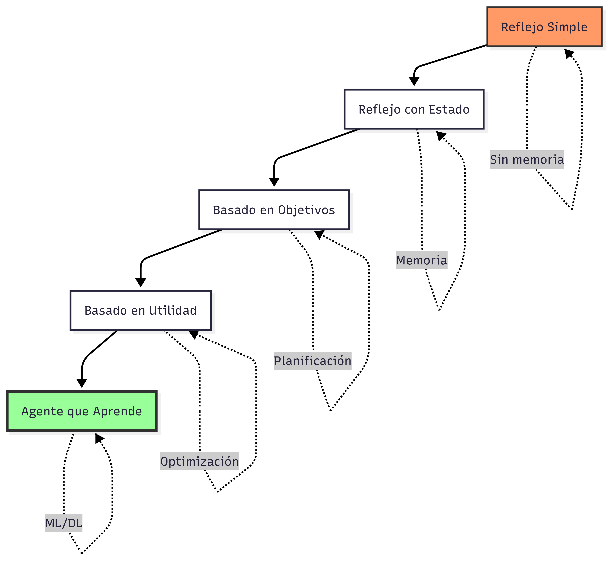
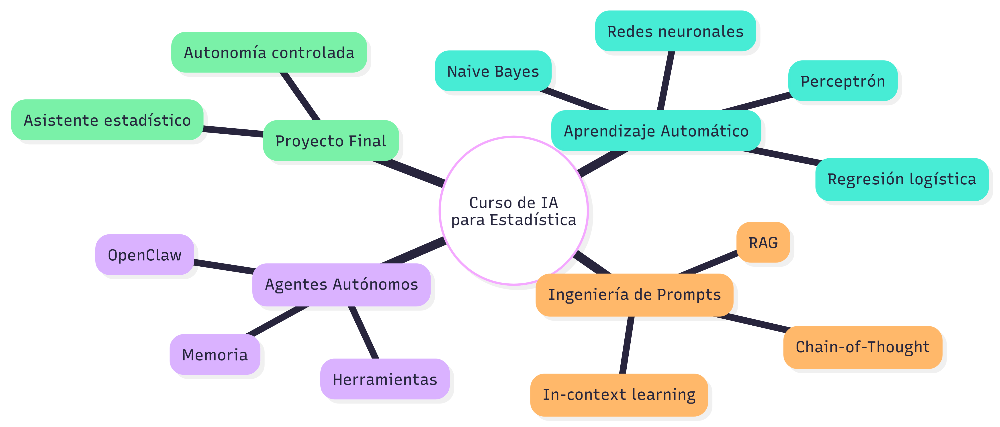

## ¿Qué es la Inteligencia Artificial?

> *"La IA es el campo que estudia cómo crear máquinas capaces de comportarse de manera inteligente."*

Pero... ¿qué significa "inteligente"?


---

## IA en la cultura popular 🎬 {.smaller}

| Medio | Ejemplos | Idea transmitida |
|-------|----------|------------------|
| **Cine** | HAL 9000 (2001), Skynet (Terminator), Wall-E, Her | IA como amenaza o compañera emocional |
| **Series** | Black Mirror (episodios "White Christmas", "Be Right Back") | Ética y consecuencias no deseadas |
| **Noticias** | ChatGPT, Gemini, Midjourney, generación de deepfakes | IA generativa accesible al público |
| **Apps diarias** | Waze (optimización rutas), Spotify (recomendación), Siri/Google Assistant | IA invisible que mejora decisiones |

> **Reflexión:** La cultura popular exagera o antropomorfiza, pero nos ayuda a preguntar: *¿qué queremos que haga una IA?*

---

## ¿En qué punto estamos? Una breve historia

```{mermaid}
timeline
    title Prehistoria de la IA
    section Antigüedad
        3000 a.C. : Autómatas<br>mitológicos
        1495 : Robot de<br>Leonardo da Vinci
    section Siglo XVII-XIX
        1642 : Pascalina<br>(calculadora)
        1837 : Máquina<br>Analítica de Babbage
        1843 : Ada Lovelace<br>primer algoritmo
    section Siglo XX
        1936 : Máquina de Turing
        1950 : Test de Turing
        1956 : Conferencia<br>Dartmouth
```

---

## La prehistoria de la IA (antes de Dartmouth)

- **Antigüedad:** Mitos de autómatas (Griegos, hebreos).
- **Siglo XVII:** Pascal, Leibniz – máquinas de calcular, razonamiento lógico.
- **1943:** McCulloch & Pitts – primer modelo matemático de neurona.
- **1950:** Alan Turing – "Computing Machinery and Intelligence", **Test de Turing**.
- **1952:** Hodgkin-Huxley – modelo biológico de potencial de acción (premio Nobel).

🔑 **Idea clave:** La inteligencia puede ser **computada** por máquinas digitales (Turing).

---

## Dartmouth 1956 – El acta de nacimiento {.smaller}

**Organizadores:** McCarthy, Minsky, Rochester, Shannon.

**Objetivo (propuesta):**

> *"Hacer que las máquinas usen lenguaje, formen abstracciones y conceptos, resuelvan problemas que ahora solo los humanos pueden resolver."*

**Resultado:** Nace el término **"Inteligencia Artificial"**. Durante 15 años, optimismo desmedido (percepción, resolución de problemas generales).

::: {.callout-note}
## ¿Sabías que?
Los asistentes a Dartmouth crearon los primeros programas de ajedrez, demostradores de teoremas geométricos y el programa de lógica de razonamiento (Logic Theorist).
:::

---

## Después de Dartmouth: Los altibajos



---

## ¿Qué puede hacer la IA en la actualidad? (2025) {.smaller}

| Capacidad | Ejemplos concretos |
|-----------|---------------------|
| **Ver** | Reconocimiento facial (iPhone), diagnóstico por imagen médica (retinopatía diabética) |
| **Oír** | Transcripción automática (Whisper), asistentes de voz (Alexa, Siri) |
| **Leer/Entender** | Resumir documentos, responder preguntas (ChatGPT, Claude, Gemini) |
| **Escribir** | Generar código, ensayos, poemas, guiones |
| **Crear imágenes** | Midjourney, DALL-E, Stable Diffusion |
| **Hablar** | Clonación de voz, conversación natural (Google Duplex) |
| **Actuar en el mundo** | Coches autónomos (Waymo, Tesla), robots domésticos (Roomba, Spot) |
| **Razonar** | Resolver problemas matemáticos, demostrar teoremas (AlphaProof) |
| **Jugar** | AlphaGo (Go), AlphaStar (StarCraft), juegos de estrategia |

> **Limitación importante:** La IA actual es *estrecha* (ANI), no *general* (AGI).

---

## Definiciones útiles y relevantes de IA

A lo largo de la historia, distintas definiciones:

:::: {.columns}
::: {.column}

```{mermaid}
quadrantChart
    title Cuatro enfoques de la IA (Russell & Norvig)
    x-axis "Imita a los humanos" --> "Maximiza Desempeño"
    y-axis "Comportamiento" --> "Pensamiento"
    quadrant-1 "Piensan racionalmente"
    quadrant-2 "Piensan como humanos"
    quadrant-3 "Actúan como humanos"
    quadrant-4 "Actúan racionalmente (agentes)"
```
:::
::: {.column}

<br>
<br>
<br>

::: {.callout-tip}
## Definición de trabajo (este curso)

> **Inteligencia Artificial = Diseño de agentes racionales que perciben su entorno y realizan acciones para maximizar su desempeño esperado.**
:::

:::

::::

---

## La perspectiva de agente racional {.smaller}

**Agente:** Cualquier cosa que percibe su entorno a través de **sensores** y actúa sobre él mediante **actuadores**.

:::: {.columns}
::: {.column}

:::
::: {.column}
**Ejemplos:**

- **Termostato:** sensor (temperatura), actuador (encender/apagar calefacción).
- **Coche autónomo:** cámaras/LiDAR (sensores), volante/freno (actuadores).
- **Chatbot:** entrada texto (sensor), respuesta texto (actuador).
:::
:::


---

## ¿Cómo abordamos el diseño de sistemas de IA?

**Pregunta central:** Dada una tarea, ¿cómo construimos el agente?

Proceso:

1. **Definir el entorno** (observable, determinista, etc.)
2. **Elegir la medida de desempeño** (precisión, velocidad, seguridad)
3. **Diseñar la arquitectura del agente** (tabla, reglas, aprendizaje, etc.)

::: {.callout-important}
## Enfoque tradicional (años 80) vs moderno
- **Antes:** Codificar conocimiento humano (sistemas expertos).
- **Ahora:** **Aprendizaje automático** – el agente aprende de datos/experiencia.
:::

---

## Agentes y entornos – Clasificación del entorno {.smaller}

Los entornos se caracterizan por **propiedades** que determinan qué tipo de agente es posible:

| Propiedad | Valores | Implicación para el agente |
|-----------|---------|-----------------------------|
| **Observabilidad** | Completa vs Parcial | Parcial → necesita memoria interna |
| **Determinismo** | Determinista vs Estocástico | Estocástico → necesita probabilidades |
| **Episodicidad** | Episódico vs Secuencial | Secuencial → planificación a largo plazo |
| **Estaticidad** | Estático vs Dinámico | Dinámico → debe reaccionar rápido |
| **Continuidad** | Discreto vs Continuo | Continuo → requiere aproximación |
| **Número de agentes** | Individual vs Multiagente | Multiagente → considerar estrategias |

---

## Ejemplos de entornos y su clasificación {.smaller}

| Entorno | Observable | Determinista | Episódico | Estático | Continuo | Multiagente |
|---------|------------|--------------|-----------|----------|----------|--------------|
| **Mundo del taxi** | Parcial | Estocástico | Secuencial | Dinámico | Continuo | Sí |
| **Diagnóstico médico** | Parcial | Estocástico | Episódico | Dinámico | Continuo | No (un paciente) |
| **Juego de ajedrez** | Completa | Determinista | Secuencial | Estático | Discreto | Sí |
| **Clasificador de spam** | Completa | Determinista | Episódico | Estático | Discreto | No |

> **Diseño del agente:** Depende críticamente del tipo de entorno.

---

## Tipos de agentes (arquitecturas)



---

## Agentes de Reflejo Simple (el más básico) {.smaller}

**Idea:** Elegir acción basada únicamente en la percepción actual (sin memoria).

```{mermaid}
---
config:
  layout: dagre
---
flowchart LR
    S["Sensor"] --> R["Reglas<br>Condición-acción"]
    R --> A["Actuador"]

     S:::Sky
     R:::Ash
     A:::Rose
    classDef Sky stroke-width:1px, stroke-dasharray:none, stroke:#374D7C, fill:#E2EBFF, color:#374D7C
    classDef Ash stroke-width:1px, stroke-dasharray:none, stroke:#999999, fill:#EEEEEE, color:#000000
    classDef Rose stroke-width:1px, stroke-dasharray:none, stroke:#FF5978, fill:#FFDFE5, color:#8E2236
```

**Ejemplo: Agente aspiradora (mundo de 2 casillas)**

```python
def agente_reflejo(percepcion):
    # percepción = (ubicación, contenido)
    ubicacion, estado = percepcion
    if estado == "sucio":
        return "aspirar"
    elif ubicacion == "A":
        return "ir a B"
    else:
        return "ir a A"
```

::: {.callout-caution}
**Limitación:** No funciona en entornos parcialmente observables o dinámicos.
:::

---

## Agentes más complejos

{width=60%}

---

## ¿Qué aprenderemos en este curso?

Énfasis en **aprendizaje automático** como base para construir agentes racionales.



---

## Temario resumido

| Módulo | Semanas | Contenido |
|--------|---------|-----------|
| **1. Fundamentos ML y DL** | 2-6 | Naive Bayes, Perceptrón, redes neuronales, LLMs (basado en CS188) |
| **2. LLMs e Ingeniería de prompts** | 7-8 | Zero/few-shot, CoT, evaluación, RAG |
| **3. Agentes autónomos con OpenClaw** | 9-11 | Instalación, skills, memoria, seguridad |
| **4. Proyecto integrador** | 12-14 | Asistente estadístico autónomo |

> **Evaluación:** 30% proyectos parciales, 30% proyecto final, 20% talleres, 20% participación/quizzes.

---

## ¿Por qué desde estadística?

> *"El aprendizaje automático es estadística computacional con esteroides."*

- **Modelos probabilísticos** (Naive Bayes, redes bayesianas) son el corazón de la IA moderna.
- **Inferencia y toma de decisiones** bajo incertidumbre.
- **Validación y métricas** (sesgo-varianza, sobreajuste, matriz de confusión).
- **Diseño de experimentos** para evaluar agentes.

**Ventaja:** Ustedes ya entienden probabilidad, muestreo, regresión – la base del deep learning.

---

## 🚀 ¿Qué Necesitamos para Empezar? (2026)

### ⚙️ Requisitos de Hardware y Sistema

*   **Computadora Personal**: Esencial para el aprendizaje práctico. Cualquier equipo doméstico básico funcionará.

*   **Sistema Operativo**: Totalmente gratuito y versátil. Puedes usar **Windows, macOS o Linux**. Si tu equipo es de bajos recursos, instalar una distribución ligera de Linux (como Ubuntu o Linux Mint) puede darle una segunda vida.

## 💻 Herramientas de Desarrollo (Gratuitas y desde Venezuela) {.smaller}

| Herramienta | Propósito | ¿Cómo acceder desde Venezuela? |
| :- | :-- | :----- |
| **Python 3.12+** | El lenguaje base de la IA. | Lo instalaremos automáticamente con la herramienta `uv`. |
| **uv** | El futuro de Python: instala Python, gestiona paquetes y entornos virtuales **10 veces más rápido** que pip. | **1. Instalación en Linux/Mac:** `curl -LsSf https://astral.sh/uv/install.sh | sh`<br>**2. Instalación en Windows:** `powershell -ExecutionPolicy ByPass -c "irm https://astral.sh/uv/install.ps1 | iex"`<br>**3. ¡Listo!** Luego de instalarlo, abre una terminal y verifica con: `uv --version`. |
| **Editor de Código** | Para escribir y ejecutar tu código. Elige el que más te guste. | • **Visual Studio Code (VS Code)**: Es **gratuito**, de código abierto, y tiene una **versión web** (vscode.dev) a la que puedes acceder sin instalar nada.<br>• **Jupyter Notebook**: Para un enfoque interactivo, lo instalaremos automáticamente con `uv`. |

## 🧠 Inteligencia Artificial (Modelos y APIs Gratuitas) {.smaller}

| Herramienta | Propósito | ¿Cómo acceder desde Venezuela? |
| :- | :--- | :--- |
| **Ollama** | **La estrella del curso**. Te permite descargar y ejecutar modelos de IA (como Llama 3, Mistral, DeepSeek) **completamente gratis y sin internet**, directamente en tu computadora. | **1. Descarga:** Ve a la página oficial de Ollama y descarga el instalador para tu sistema operativo.<br>**2. Ejecuta un modelo:** Abre la terminal y escribe: `ollama run llama3.2`. ¡La IA empezará a hablar contigo! |
| **Hugging Face** | El "GitHub de la IA". Ofrece una **API de Inferencia gratuita** para probar más de 150,000 modelos de IA en la nube. | **1. Crea una cuenta gratuita** en huggingface.co. <br>**2. Obtén tu `API Token` gratis** en la configuración de tu perfil. |
| **Google Colab** | Un entorno de Jupyter Notebook **en la nube y gratuito**, que incluye acceso a **GPUs y TPUs** para entrenar modelos complejos sin necesidad de tener una PC potente. | **1. Accede** a colab.research.google.com. <br>**2. Inicia sesión con tu cuenta de Google. ¡Es todo!** |

## 🔧 Configuración Rápida del Entorno

Con `uv` instalado, la preparación del entorno es increíblemente rápida. Abre tu terminal y ejecuta:

```bash
# 1. Instalar Python (uv lo descarga automáticamente si no lo tienes)
uv python install

# 2. Crear un entorno virtual para el curso
uv venv --python 3.12

# 3. Activar el entorno virtual (ejemplo en Windows)
.venv\Scripts\activate
# En Linux/Mac: source .venv/bin/activate

# 4. Instalar las librerías que usaremos
uv pip install jupyter numpy pandas matplotlib scikit-learn

# ¡Listo! Ahora puedes ejecutar Jupyter Lab
jupyter lab
```

## ¡Gracias! {.smaller}

**Repositorio del curso:**  
[https://github.com/map0logo/est6047-ia](https://github.com/map0logo/est6047-ia)  
(espejo en Codeberg)

**Bibliografía principal:**

- Russell & Norvig (2021). *Artificial Intelligence: A Modern Approach* (4th ed.).  
- Sección ML del curso CS188 de UC Berkeley.
- (Se irán añadiendo más referencias)

##


**Próxima clase:** Instalación de entorno, repaso de Python estadístico y primeros pasos con Naive Bayes.

*"La mejor manera de predecir el futuro es implementarlo"* – Alan Kay

