# Redes Neuronales Artificiales (ANNs)

## Inspiración biológica

- Las ANNs están inspiradas en el sistema nervioso y el cerebro
- Las neuronas biológicas reciben señales (dendritas), las procesan (núcleo) y transmiten resultados (axón)
- Aprendizaje mediante práctica: como un niño aprendiendo a beber de un vaso

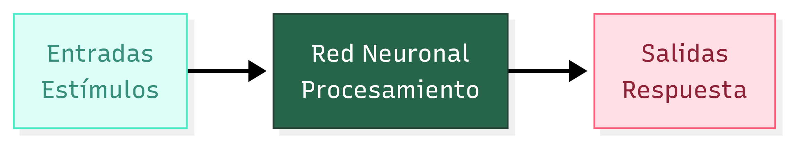

---

## La neurona biológica

- **Dendritas**: reciben señales
- **Cuerpo celular y núcleo**: activan y ajustan la señal
- **Axón**: transmite la señal
- **Sinapsis**: ajustan la señal antes de pasarla a la siguiente neurona

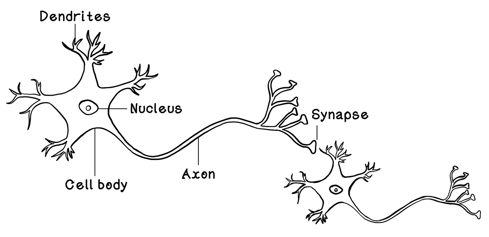{.r-stretch}

# El Perceptrón: Representación de una neurona

## Arquitectura del Perceptrón {.smaller}

- Modelo lógico de una neurona biológica
- Componentes:
  - **Entradas** ($x_i$): valores de entrada
  - **Pesos** ($w_i$): intensidad de cada conexión
  - **Nodo oculto**: suma ponderada + función de activación
  - **Salida**: resultado final

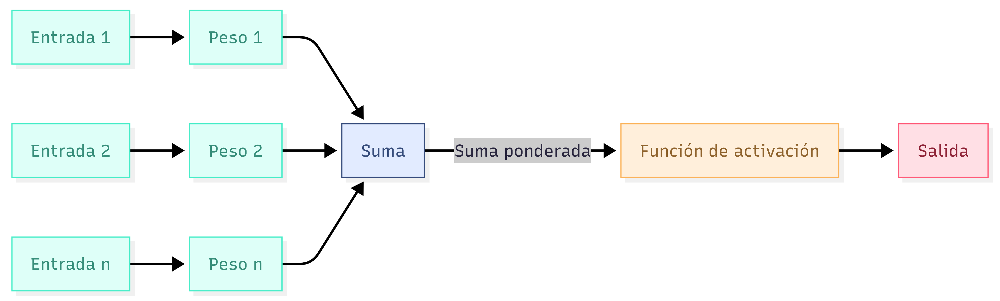{.r-stretch}

---

## Ejemplo: Alquiler de apartamentos

- **Entradas**: precio (escalado) y tamaño (escalado)
- **Pesos**: aprendidos previamente
- **Salida**: probabilidad de que se alquile en un mes

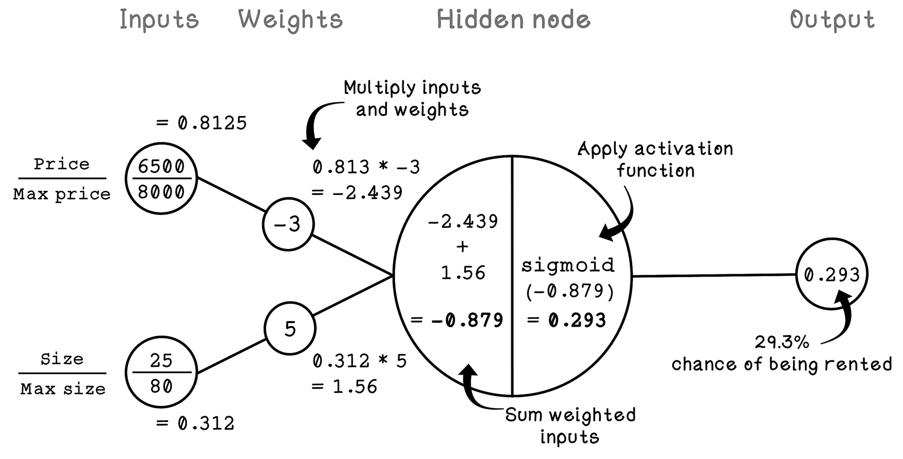{.r-stretch}

---

## Función de activación Sigmoide

- Toma cualquier valor real y lo comprime entre 0 y 1
- Útil para probabilidades
- Problema: **gradiente evanescente** para valores extremos

::: {.columns}

::: {.column}

$$
\sigma(x) = \frac{1}{1 + e^{-x}}
$$

:::

::: {.column}

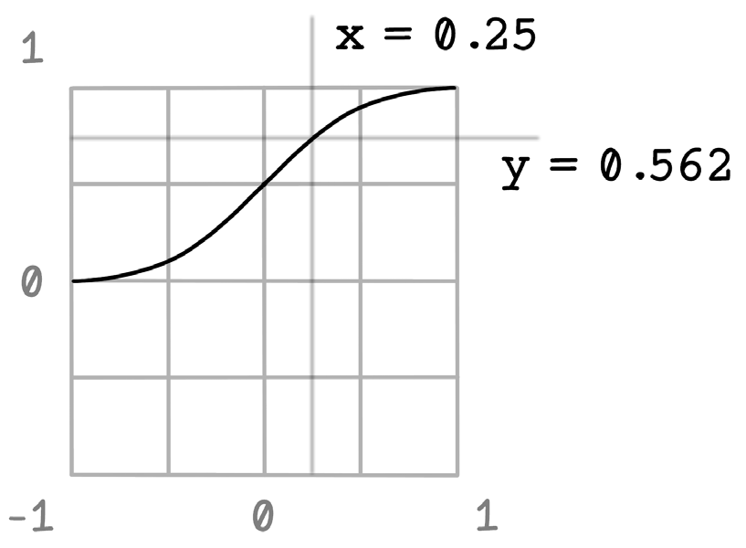{.c-stretch}

:::

:::


---

## Ejercicio: Calcular la salida del Perceptrón

Dados los siguientes valores:

- Entradas: $[0.8, 0.3]$
- Pesos: $[1.2, -0.5]$
- Sesgo: $0.1$
- Función de activación: sigmoide

**Solución**:

1. Suma ponderada: $0.8 \times 1.2 + 0.3 \times (-0.5) + 0.1 = 0.96 - 0.15 + 0.1 = 0.91$  
2. Sigmoide: $\sigma(0.91) = \frac{1}{1+e^{-0.91}} \approx 0.713$

# Definiendo ANNs

## De Perceptrón a redes multicapa

- Una sola neurona solo resuelve problemas **lineales**
- Las ANNs usan múltiples nodos ocultos para problemas **no lineales**
- Ejemplo: clasificación de colisiones de coches

| Velocidad | Calidad terreno | Grados visión | Experiencia | ¿Colisión? |
|-----------|----------------|---------------|-------------|-------------|
| 65 km/h   | 5/10           | 180°          | 80,000 km   | No          |
| 120 km/h  | 1/10           | 72°           | 110,000 km  | Sí          |

---

## Escalado de datos (Min-Max)

- Las ANNs no tienen contexto de las magnitudes
- Escalamos cada característica al rango [0, 1] para comparabilidad
- Fórmula: $x_{\text{escalado}} = \frac{x - \min}{\max - \min}$

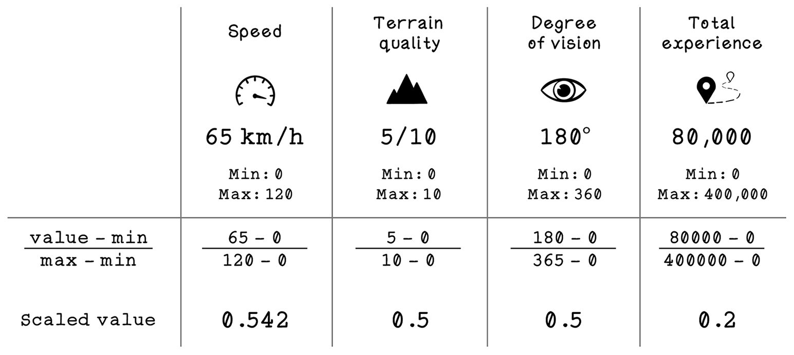{.r-stretch}

---

## Código Python para escalado

```python
def scale_dataset(dataset, mins, maxs):
    scaled = []
    for example in dataset:
        scaled_example = []
        for i, value in enumerate(example):
            scaled_value = (value - mins[i]) / (maxs[i] - mins[i])
            scaled_example.append(scaled_value)
        scaled.append(scaled_example)
    return scaled
```

---

## Arquitectura de una ANN simple

- **Capa de entrada**: 4 nodos (características)
- **Capa oculta**: 5 nodos (neuronas artificiales)
- **Capa de salida**: 1 nodo (probabilidad de colisión)

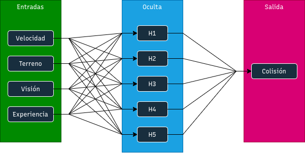{.r-stretch}

---

## Representación matemática

- **Entradas**: vector $\mathbf{X} = [x_0, x_1, x_2, x_3]$
- **Pesos capa entrada → oculta**: matriz $4 \times 5$
- **Pesos capa oculta → salida**: vector $5 \times 1$

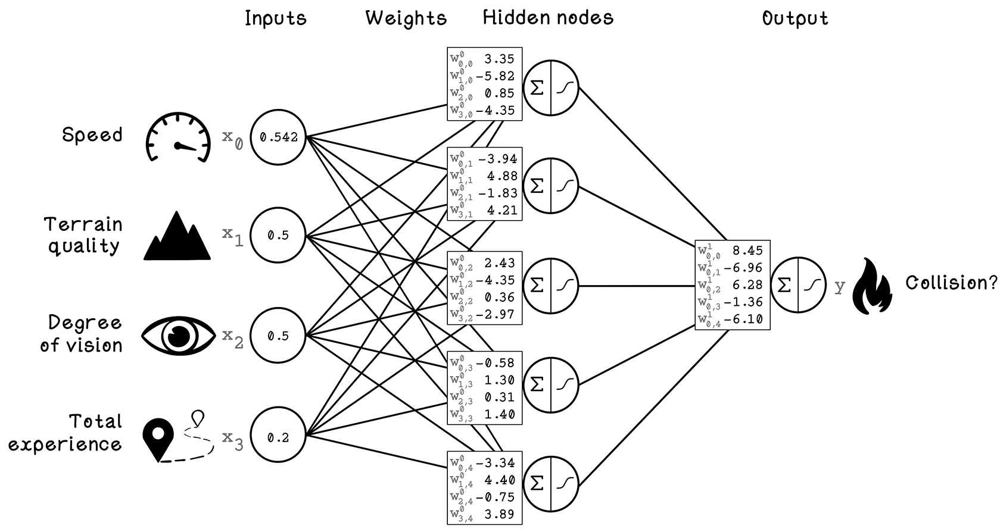{.r-stretch}

# Propagación hacia adelante (Forward Propagation)

## Pasos del algoritmo

:::: {.columns}

::: {.column width="50%"}

1. Ingresar un ejemplo
2. Multiplicar entradas por pesos (capa oculta)
3. Sumar resultados ponderados por nodo oculto
4. Aplicar función de activación a cada nodo oculto
5. Sumar resultados ponderados hacia la salida
6. Aplicar función de activación a la salida

:::

::: {.column width="50%"}

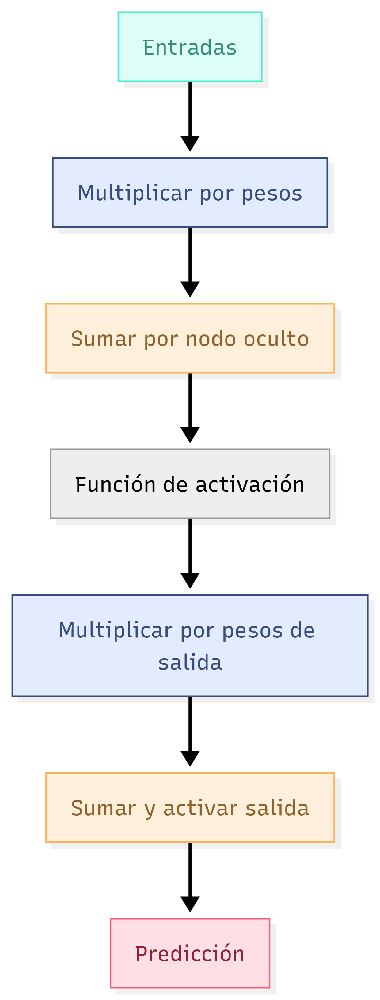{height="600"}

:::

::::


---

## Ejemplo numérico

Datos escalados: $[0.542, 0.5, 0.5, 0.2]$

**Cálculo del primer nodo oculto**:

- Suma ponderada: $0.542 \times 3.35 + 0.5 \times (-5.82) + 0.5 \times 0.85 + 0.2 \times (-4.35) = -1.99$
- Activación sigmoide: $\sigma(-1.99) \approx 0.120$

**Resultado final** (tras todos los nodos): $0.00214$ → 0.214% de probabilidad de colisión

---

## Código Python: Forward propagation

```python
def sigmoid(x):
    return 1 / (1 + np.exp(-x))

class NeuralNetwork:
    def forward_propagation(self):
        # Capa oculta
        self.hidden = sigmoid(np.dot(self.input, self.weights_input))
        # Capa de salida
        self.output = sigmoid(np.dot(self.hidden, self.weights_hidden))
```

# Retropropagación (Backpropagation)

## Fases del entrenamiento {.smaller}

- **Fase A**: Configurar arquitectura e inicializar pesos aleatoriamente
- **Fase B**: Propagación hacia adelante (obtener predicción)
- **Fase C**: Calcular error y ajustar pesos

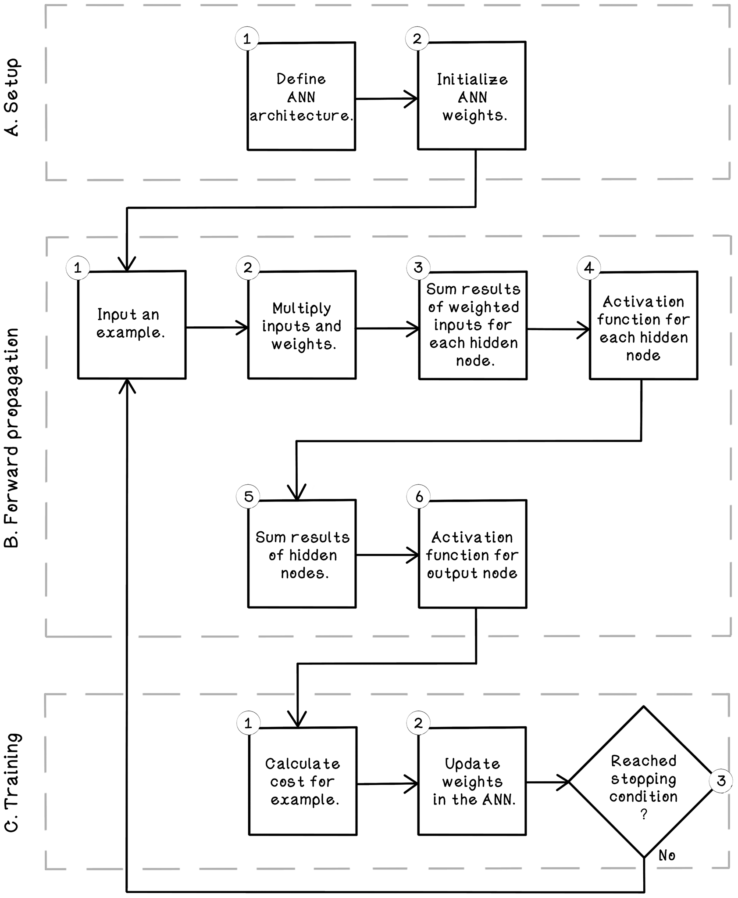{.r-stretch}

---

## Cálculo del costo (error)

Usamos error cuadrático medio (MSE) para un ejemplo:

$$
J = \frac{1}{2}(y - \hat{y})^2
$$

Ejemplo: si $\hat{y} = 0.84274$ e $y = 0$ (no colisión), entonces $J = \frac{1}{2}(-0.84274)^2 = 0.355$

---

## Descenso del gradiente

- Queremos minimizar el costo $J$ ajustando los pesos
- El gradiente indica la dirección de máximo crecimiento
- Movemos los pesos en dirección contraria al gradiente

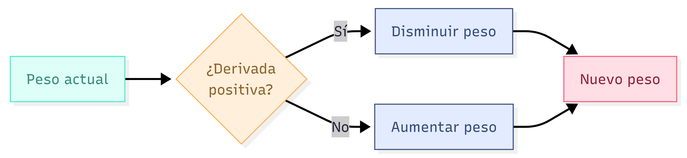

## Pendientes y derivadas de los mínimos

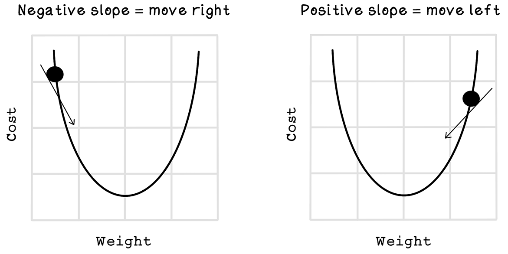{.r-stretch}

---

## Regla de la cadena (Chain Rule)

- El peso no afecta directamente el costo, sino a través de capas intermedias
- Usamos la regla de la cadena para propagar el error hacia atrás

$$ \frac{\partial J}{\partial W} = \frac{\partial J}{\partial \text{output}} \cdot \frac{\partial \text{output}}{\partial \text{oculta}} \cdot \frac{\partial \text{oculta}}{\partial W} $$

---

## Actualización de pesos

**Cálculo para pesos oculta → salida**:
$$ \delta_{\text{output}} = (\hat{y} - y) \cdot \sigma'(Z_{\text{output}}) $$
**Actualización**:
$$ W_{\text{nuevo}} = W_{\text{viejo}} - \alpha \cdot \nabla W $$

## Ejemplo de actualización de pesos

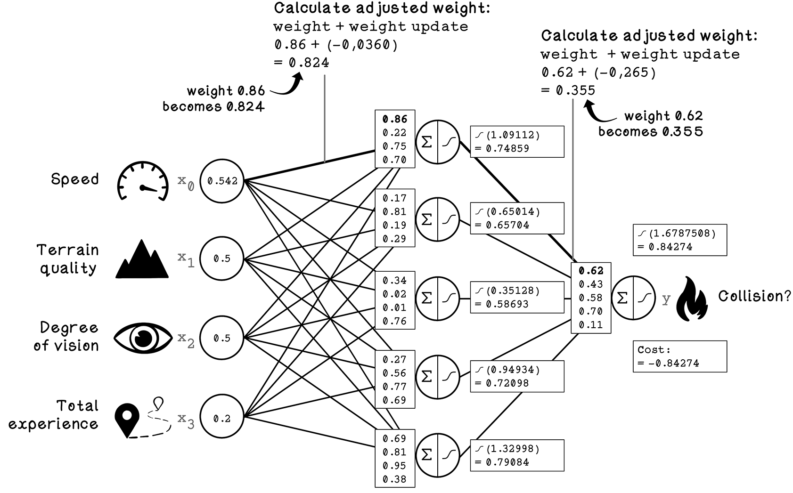{.r-stretch}

---

## Código Python: Backpropagation

```python
def sigmoid_derivative(x):
    return sigmoid(x) * (1 - sigmoid(x))

def back_propagation(self, learning_rate):
    # Error en salida
    output_error = self.output - self.expected_output
    delta_output = output_error * sigmoid_derivative(self.output)
    
    # Error en capa oculta
    hidden_error = np.dot(delta_output, self.weights_hidden.T)
    delta_hidden = hidden_error * sigmoid_derivative(self.hidden)
    
    # Actualizar pesos
    self.weights_hidden -= learning_rate * np.dot(self.hidden.T, delta_output)
    self.weights_input -= learning_rate * np.dot(self.input.T, delta_hidden)
```

# Funciones de activación

## Comparativa

| Función | Rango | Derivada | Problema típico |
|---------|-------|----------|----------------|
| Step | {0,1} | 0 (excepto salto) | No aprendible |
| Sigmoide | (0,1) | $\sigma(x)(1-\sigma(x))$ | Gradiente evanescente |
| Tanh | (-1,1) | $1-\tanh^2(x)$ | Gradiente evanescente |
| ReLU | [0,∞) | 0 si x<0, 1 si x>0 | Neuronas muertas |

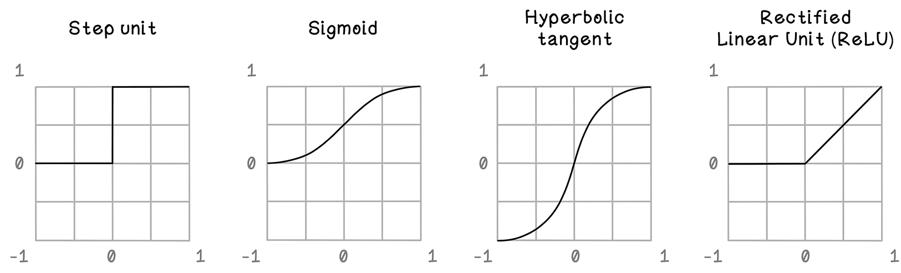{.r-stretch}

# Diseño de ANNs

## Parámetros configurables

- **Número de capas ocultas** y **neuronas por capa**
- **Inicialización de pesos** (Xavier, He, etc.)
- **Sesgo (bias)**: permite desplazar la función de activación
- **Función de costo** (MSE, entropía cruzada, etc.)
- **Tasa de aprendizaje ($\alpha$)**

---

## Inicialización de pesos (principio de Goldilocks)

- Pesos muy pequeños → gradiente evanescente
- Pesos muy grandes → gradiente explosivo
- Inicialización Xavier: $W \sim \mathcal{N}(0, \frac{1}{n_{\text{entradas}}})$


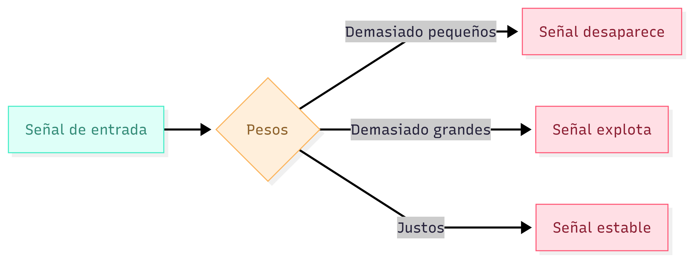{.r-stretch}


# Expresión matemática de ANNs

## Producto punto y multiplicación de matrices

- Suma ponderada: $z = \mathbf{X} \cdot \mathbf{W} + b$
- Capa oculta: $\mathbf{H} = \sigma(\mathbf{X} \cdot \mathbf{W}_{\text{entrada}})$
- Salida: $\hat{y} = \sigma(\mathbf{H} \cdot \mathbf{W}_{\text{oculta}})$

**Ecuación completa**:
$$ \hat{y} = \sigma\left(\sigma\left(\mathbf{X} \cdot \mathbf{W}_{\text{entrada}}\right) \cdot \mathbf{W}_{\text{oculta}}\right) $$

---

## Tensores

- Escalar: número simple (0D)
- Vector: arreglo 1D
- Matriz: tabla 2D
- Tensor: generalización a 3D o más (ej. lotes de imágenes RGB)

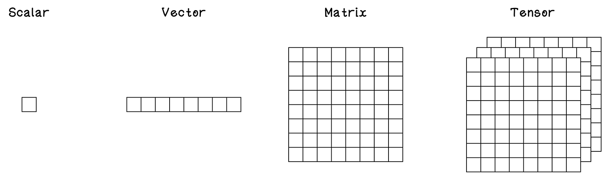{.r-stretch}

# Tipos de ANNs y casos de uso

## Redes Neuronales Recurrentes (RNN) {.smaller}

- Procesan **secuencias** de longitud variable
- Tienen memoria (estado oculto que se realimenta)
- Útiles para: texto, audio, series temporales

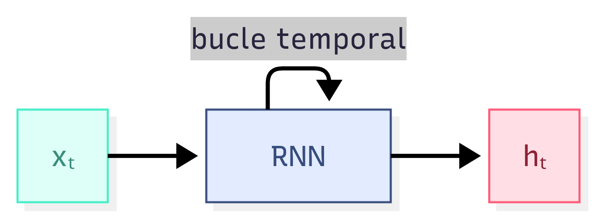{width=40%}

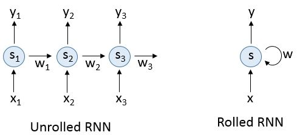{.r-stretch}

---

## Redes Neuronales Convolucionales (CNN) {.smaller}

- Especializadas en **imágenes**
- Usan filtros (convoluciones) y pooling para extraer características
- Útiles para: clasificación de imágenes, detección de objetos, OCR

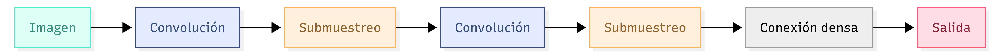

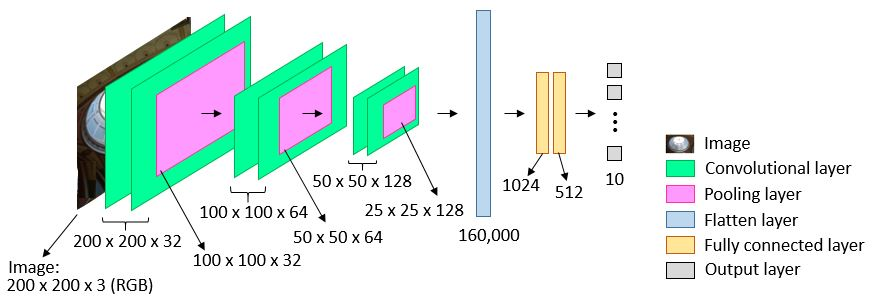{.r-stretch}

---

## Redes Generativas Adversarias (GAN){.smaller}

- Dos redes compiten: **generador** (crea datos falsos) y **discriminador** (distingue reales de falsos)
- El generador mejora hasta engañar al discriminador
- Usos: generación de imágenes, deepfakes, mejora de resolución

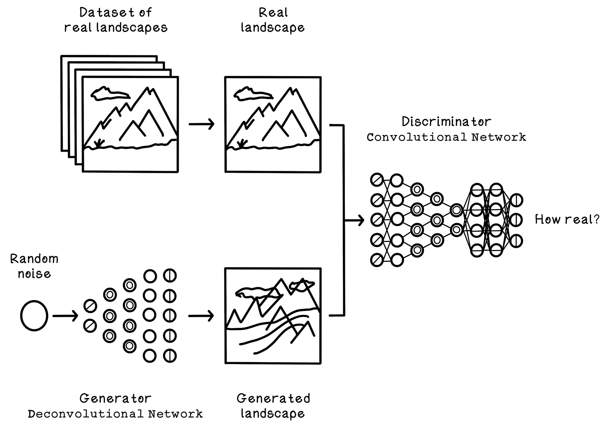{.r-stretch}

# Resumen

- Las ANNs son modelos flexibles inspirados en el cerebro
- El Perceptrón resuelve problemas lineales; las ANNs multicapa resuelven no linealidades
- **Propagación hacia adelante**: calcula la salida dados los pesos
- **Retropropagación**: ajusta los pesos usando descenso del gradiente y la regla de la cadena
- La arquitectura (capas, activaciones, inicialización) es clave para el rendimiento
- Existen variantes especializadas: RNN, CNN, GAN

---

## ¿Preguntas?

**Recursos adicionales**:

- *Grokking Deep Learning* de Andrew W. Trask
- *Deep Learning with Python* de François Chollet

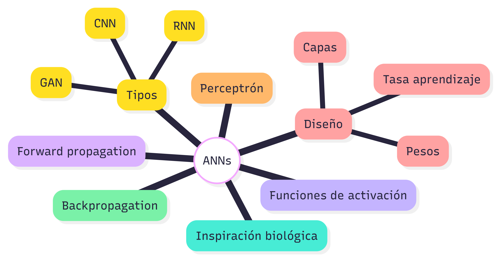{.r-stretch}
