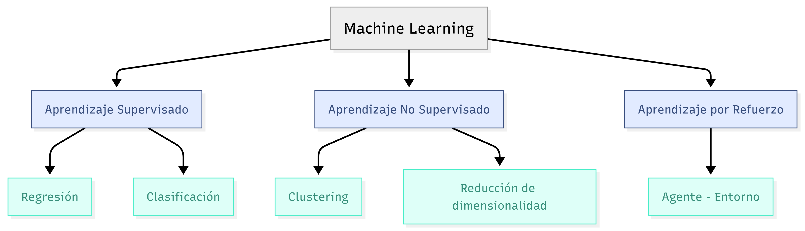
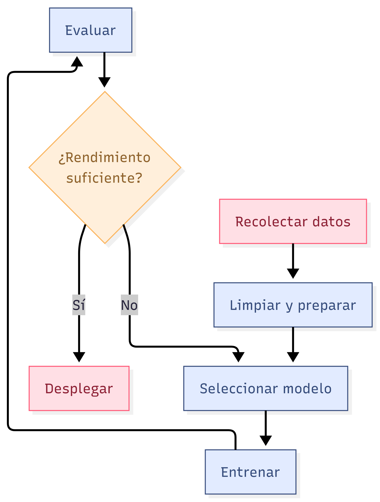
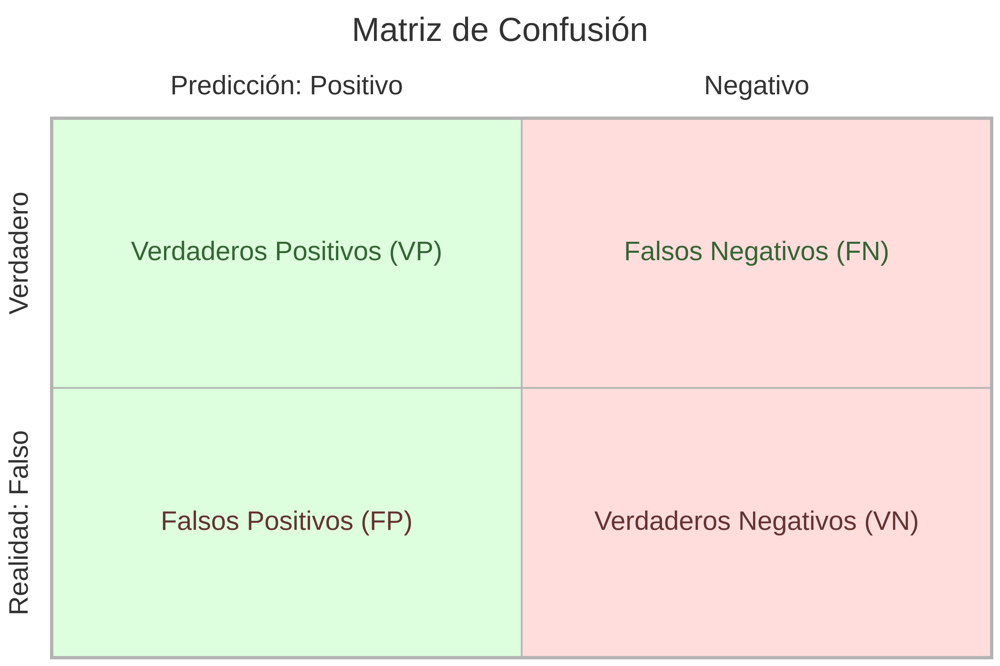
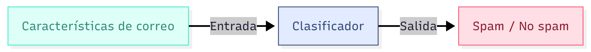

# 9. Machine Learning

**Autor original:** Nikhil Sharma  
**Edición:** Samantha Huang y Wesley Zheng  
**Créditos:** Adaptado de *Artificial Intelligence: A Modern Approach*  
**Última actualización:** Septiembre 2024

---

## ¿Qué es Machine Learning?

- Subcampo de la Inteligencia Artificial
- Los sistemas aprenden de datos, no de reglas explícitas
- Mejoran su rendimiento con la experiencia (datos)

> *"Un programa de ML aprende a partir de la experiencia E con respecto a una tarea T y una medida de rendimiento P."*  
> — Tom Mitchell

---

## Tipos de aprendizaje

---

## Aprendizaje Supervisado

- Datos de entrenamiento con **etiquetas** (entrada + salida esperada)
- Objetivo: predecir la salida para nuevas entradas

**Ejemplos:**

1. Regresión: predecir precio de una casa
2. Clasificación: identificar spam (sí/no)

---

## Aprendizaje No Supervisado

- Datos **sin etiquetas**
- Buscar estructuras o patrones ocultos

**Ejemplos:**

1. Clustering: agrupar clientes por comportamiento
2. Reducción de dimensionalidad: PCA para visualización

---

## Aprendizaje por Refuerzo

- Un agente interactúa con un entorno
- Recibe **recompensas** o **castigos** por sus acciones
- Objetivo: maximizar la recompensa acumulada

**Ejemplo:** AlphaGo, vehículos autónomos

---

## Conceptos clave

- **Características (features):** variables de entrada
- **Etiquetas (labels):** salida deseada (en supervisado)
- **Entrenamiento:** ajustar modelo con datos etiquetados
- **Prueba (test):** evaluar con datos no vistos
- **Overfitting:** memoriza ruido, no generaliza
- **Underfitting:** modelo demasiado simple

---

## Proceso típico de un proyecto de ML

{.r-stretch}

---

## Evaluación de modelos (Clasificación) {.smaller}

**Matriz de confusión para 2 clases:**

{.r-stretch}

**Métricas comunes:**

- **Exactitud** = (VP + VN) / N 
- **Precisión** = VP / (VP + FP)
- **Recall** = VP / (VP + FN)
- **F1** = 2 * (Precisión * Recall) / (Precisión + Recall)

---

## Ejemplo sencillo

**Regresión lineal** (predecir número continuo)

**Clasificación binaria** (dos categorías)

---

## Resumen

- ML aprende patrones a partir de datos
- Tres grandes familias: supervisado, no supervisado, por refuerzo
- El proceso incluye entrenamiento, evaluación y despliegue
- Evaluar con métricas apropiadas según el problema

**Preguntas:** ¡Revisa los ejemplos y experimenta!
