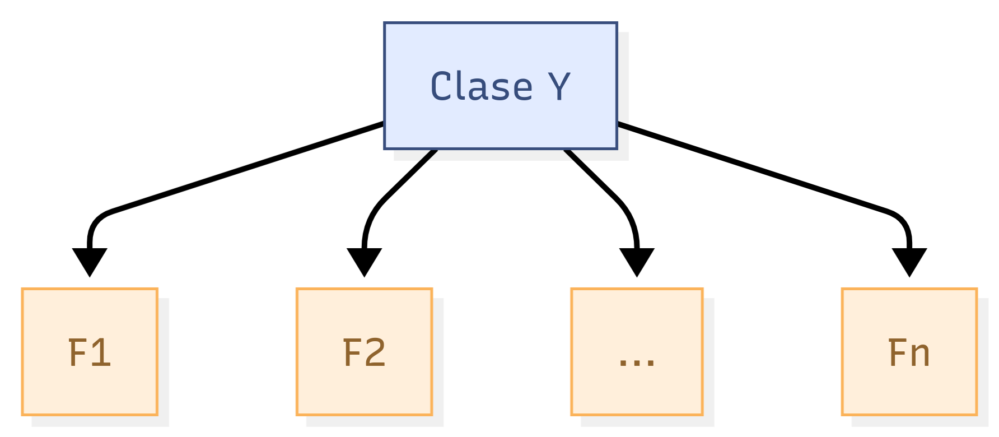
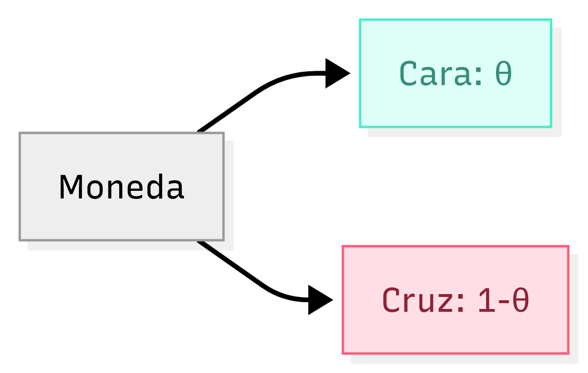

# 9.2 Naive Bayes

Clasificador Bayesiano Ingenuo

---

## Motivación: Filtro de spam

- Problema de **clasificación** (spam vs. ham)
- Cada correo es un punto de datos
- Conjunto de entrenamiento con etiquetas (spam/ham)
- Objetivo: predecir etiqueta de correos no vistos

---

## Características (features)

- Extraer atributos relevantes de cada correo
- Ejemplos: presencia de ciertas palabras, mayúsculas, patrones
- **Feature engineering**: decisión clave para el rendimiento

Para este curso: asumimos que las características ya están extraídas.

---

## Vector de características

- Diccionario de $n$ palabras
- Vector $F \in \mathbb{R}^n$, donde $F_i = 1$ si la palabra $i$ aparece, $0$ en otro caso

Ejemplo:  
$$
F_{200} = 1
$$ 

si aparece la palabra "gratis"

---

## Problema: tamaño exponencial

Queremos calcular:

$$
P(Y = \text{spam} \mid F_1 = f_1, \dots, F_n = f_n)
$$

La tabla de probabilidad conjunta tendría $2^{n+1}$ entradas → **inviable** para $n$ grande.

---

## Solución: Suposición Naive Bayes

**Suposición clave:** cada característica $F_i$ es **independiente** de las demás dado la etiqueta de clase $Y$.

Esto es una simplificación fuerte (de ahí lo de *naive*), pero funciona bien en la práctica.

---

## Estructura de la red bayesiana

{.r-stretch}

- Tablas: $P(Y)$ (2 entradas) y $P(F_i \mid Y)$ (4 entradas cada una)
- Total: $4n + 2$ entradas → **lineal en n**

---

## Predicción con Naive Bayes

Queremos la clase más probable dadas las características observadas:

$$
\text{predicción}(f_1,\dots,f_n) = \underset{y}{\text{argmax}} \, P(Y=y) \prod_{i=1}^n P(F_i=f_i \mid Y=y)
$$

- Se obtiene de la regla de Bayes + independencia condicional
- No es necesario normalizar (el denominador es constante)

---

## Generalización a $k$ clases

Para $k$ clases posibles $y_1, \dots, y_k$:

$$
\begin{bmatrix}
P(Y=y_1)\prod_i P(F_i=f_i \mid Y=y_1) \\
P(Y=y_2)\prod_i P(F_i=f_i \mid Y=y_2) \\
\vdots \\
P(Y=y_k)\prod_i P(F_i=f_i \mid Y=y_k)
\end{bmatrix}
$$

La predicción es la clase con el valor máximo.

---

## Estimación de parámetros: MLE

¿Cómo aprender las tablas $P(F_i \mid Y)$ y $P(Y)$ a partir de datos?

Usamos **Máxima Verosimilitud (MLE)**

Suposiciones:

1. Datos **independientes e idénticamente distribuidos (i.i.d.)**
2. Todos los valores de $\theta$ son igualmente probables a priori (uniforme)

---

## Ejemplo de MLE: moneda

Lanzamos una moneda 3 veces: cara, cara, cruz.

- $\theta = P(\text{cara})$
- Verosimilitud: $\mathcal{L}(\theta) = \theta^2 (1-\theta)$
- Derivada e igualar a cero: $\theta(2-3\theta)=0 \Rightarrow \theta = 2/3$

{.r-stretch}

---

## MLE para Naive Bayes (resultado clave)

Para $P(F_i = 1 \mid Y = \text{ham})$:

$$
\theta = \frac{1}{N_h} \sum_{j=1}^{N_h} f_i^{(j)}
$$

Es decir: **contar** cuántos correos ham contienen la palabra $i$ y dividir por el total de correos ham.

Análogo para $Y = \text{spam}$.

---

## Problema de sobreajuste (overfitting)

Si una palabra nunca aparece en correos ham en el entrenamiento:

$$
P(F_i=1 \mid Y=\text{ham}) = 0
$$

Cualquier correo nuevo con esa palabra tendrá probabilidad cero de ser ham → **no generaliza**.

Solución: **Suavizado de Laplace**

---

## Suavizado de Laplace

Fórmula general para un evento $x$ con $|X|$ valores posibles:

$$
P_{\text{LAP},k}(x) = \frac{\text{count}(x) + k}{N + k|X|}
$$

Para probabilidades condicionales:

$$
P_{\text{LAP},k}(x \mid y) = \frac{\text{count}(x,y) + k}{\text{count}(y) + k|X|}
$$

---

## Interpretación del suavizado

- $k=0$: vuelve a MLE
- $k \to \infty$: todas las probabilidades se vuelven $1/|X|$ (uniforme)
- $k$ es un **hiperparámetro** que se ajusta con validación

Ejemplo: palabra "minuto" nunca vista en ham. Con $k=1$ y $|X|=2$:

$$
P(\text{minuto}=1 \mid \text{ham}) = \frac{0+1}{N_h + 2}
$$

---

## Resumen

- Naive Bayes: clasificador basado en independencia condicional
- Predicción: $\arg\max_y P(Y=y)\prod_i P(F_i \mid Y=y)$
- Parámetros se estiman con MLE (conteos)
- Suavizado de Laplace evita sobreajuste

**Ventajas:** simple, rápido, funciona bien en texto

**Desventajas:** suposición de independencia a menudo falsa

{.r-stretch}
