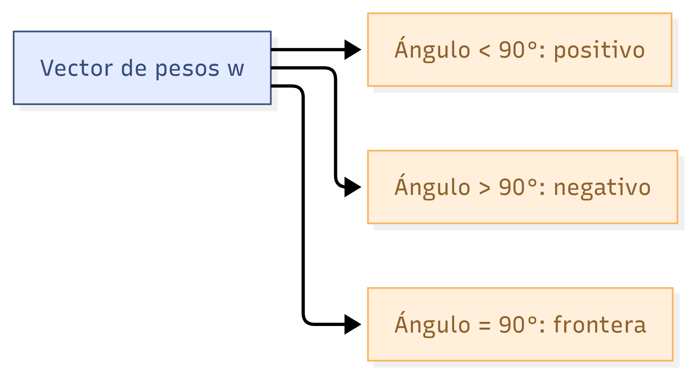
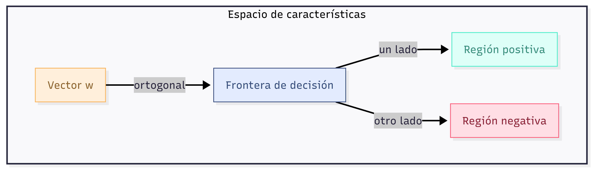
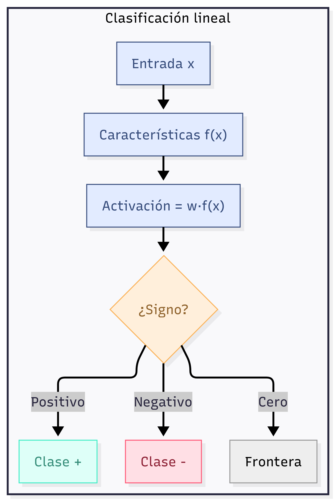
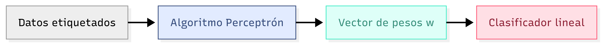

# 9.3 Perceptron

Clasificadores lineales y el algoritmo Perceptron

---

## Clasificadores lineales

- Alternativa a Naive Bayes: **no** estimamos distribuciones de probabilidad
- Usamos una combinación lineal de las características
- Ideal para **clasificación binaria** (positivo / negativo)

---

## Activación (función de activación)

Dado un punto de datos $\mathbf{x}$ con características $\mathbf{f}(\mathbf{x})$ y pesos $\mathbf{w}$:

$$
\text{activación}_{\mathbf{w}}(\mathbf{x}) = \sum_i w_i f_i(\mathbf{x}) = \mathbf{w}^T \mathbf{f}(\mathbf{x})
$$

Este valor también se denota como $h_{\mathbf{w}}(\mathbf{x})$.

---

## Regla de clasificación

Clasificamos según el signo de la activación:

$$
\text{clasificar}(\mathbf{x}) =
\begin{cases}
+ & \text{si } h_{\mathbf{w}}(\mathbf{x}) > 0 \\
- & \text{si } h_{\mathbf{w}}(\mathbf{x}) < 0 
\end{cases}
$$

Si la activación es cero, el punto está sobre la frontera (podemos asignar cualquier clase).

---

## Interpretación geométrica

Reescribimos el producto punto:

$$
h_{\mathbf{w}}(\mathbf{x}) = \|\mathbf{w}\| \|\mathbf{f}(\mathbf{x})\| \cos(\theta)
$$

donde $\theta$ es el ángulo entre $\mathbf{w}$ y $\mathbf{f}(\mathbf{x})$.

Como las magnitudes son no negativas, el signo depende solo de $\cos(\theta)$.

---

## Condición sobre el ángulo

- $\cos(\theta) > 0 \iff \theta < 90^\circ$ (ángulo agudo) → clase **positiva**
- $\cos(\theta) < 0 \iff \theta > 90^\circ$ (ángulo obtuso) → clase **negativa**

{.r-stretch}

---

## Frontera de decisión

- Puntos con $\mathbf{w}^T \mathbf{f}(\mathbf{x}) = 0$ son ortogonales a $\mathbf{w}$
- Forman una **línea (en 2D)** o **hiperplano (en más dimensiones)**

{.r-stretch}

---

## Hiperplano de separación

- En 2D: una línea recta
- En 3D: un plano
- En $n$ dimensiones: un hiperplano de dimensión $n-1$

La frontera divide el espacio en dos mitades, una para cada clase.

---

## Visualización conceptual

{.r-stretch}

---

## Resumen

- Los clasificadores lineales usan una combinación ponderada de características
- La activación determina la clase por su signo
- La frontera de decisión es un hiperplano ortogonal al vector de pesos
- El perceptrón (próxima sección) aprenderá estos pesos a partir de datos

{.r-stretch}

