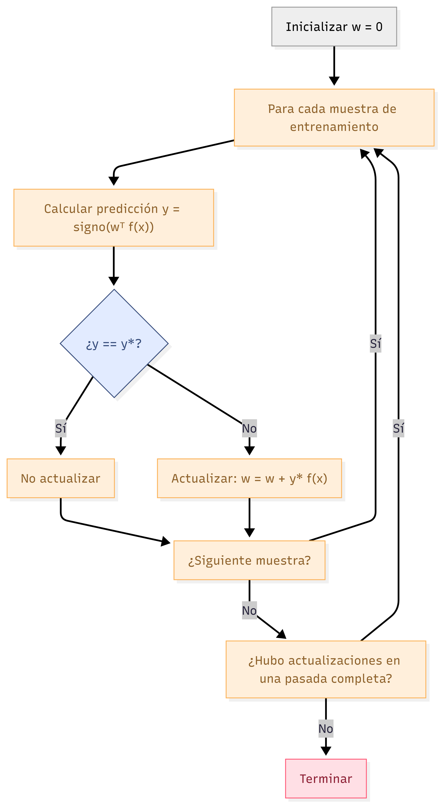

## Objetivo de la presentación

- Aprender el funcionamiento del perceptrón binario.
- Comprender la actualización de pesos.
- Incorporar el sesgo (bias).
- Ver un ejemplo paso a paso.
- Extender a clasificación multiclase.

---

## Clasificadores lineales

- Un clasificador lineal separa clases mediante una **frontera de decisión** (hiperplano).
- Se entrena con un **conjunto de entrenamiento** con etiquetas correctas.
- El perceptrón busca **pesos** que clasifiquen perfectamente los datos.

---

## Perceptrón binario: objetivo

Dado un conjunto de entrenamiento con características $\mathbf{f}(\mathbf{x})$ y etiquetas $y^* \in \{-1, +1\}$, encontrar $\mathbf{w}$ tal que:

$$
\text{signo}(\mathbf{w}^T \mathbf{f}(\mathbf{x})) = y^* \quad \text{para todo } \mathbf{x}
$$

---

## Algoritmo del perceptrón

{.r-stretch}

---

## Inicialización y regla de clasificación

- **Inicialización**: $\mathbf{w} = \mathbf{0}$
- **Clasificación**:
  $$
  y = \begin{cases} +1 & \text{si } \mathbf{w}^T \mathbf{f}(\mathbf{x}) > 0 \\ -1 & \text{si } \mathbf{w}^T \mathbf{f}(\mathbf{x}) < 0 \end{cases}
  $$

---

## Actualización de pesos

Cuando hay error, se actualiza:

$$
\mathbf{w} \leftarrow \mathbf{w} + y^* \mathbf{f}(\mathbf{x})
$$

- **Caso 1**: $y^* = +1$, predicho $-1$ → $\mathbf{w} \leftarrow \mathbf{w} + \mathbf{f}(\mathbf{x})$
- **Caso 2**: $y^* = -1$, predicho $+1$ → $\mathbf{w} \leftarrow \mathbf{w} - \mathbf{f}(\mathbf{x})$

---

## ¿Por qué funciona? (Caso 1)

Si $y^* = +1$ pero $\mathbf{w}^T \mathbf{f}(\mathbf{x}) < 0$ (activación muy pequeña):

Actualizamos $\mathbf{w} \leftarrow \mathbf{w} + \mathbf{f}(\mathbf{x})$

Nueva activación:

$$
(\mathbf{w} + \mathbf{f}(\mathbf{x}))^T \mathbf{f}(\mathbf{x}) = \mathbf{w}^T \mathbf{f}(\mathbf{x}) + \mathbf{f}(\mathbf{x})^T \mathbf{f}(\mathbf{x})
$$

Aumenta en $\|\mathbf{f}(\mathbf{x})\|^2 > 0$, acercándose a positivo.

---

## Justificación intuitiva de la actualización

- Queremos cambiar más los pesos que más contribuyeron al error.
- Usar el propio vector $\mathbf{f}(\mathbf{x})$ como actualización logra:
  - Cambiar mucho las dimensiones con valores altos.
  - Cambiar poco las dimensiones con valores bajos.
  - No cambiar dimensiones con valor cero.

---

## El problema del origen

Sin sesgo, la frontera siempre pasa por el origen:

$$
\mathbf{w}^T \mathbf{f}(\mathbf{x}) = 0
$$

Muchos problemas requieren una frontera que no pase por el origen.

---

## Solución: añadir sesgo (bias)

- Agregamos una **característica constante** $f_0 = 1$ a cada vector.
- Agregamos un peso extra $w_0$ (el sesgo).
- Nueva frontera: $\mathbf{w}^T \mathbf{f}(\mathbf{x}) + b = 0$, donde $b = w_0$.

```{mermaid}
flowchart LR
    subgraph Sin sesgo
        A[f(x)] --> B[w^T f(x) = 0]
    end
    subgraph Con sesgo
        C[f(x) con 1 al inicio] --> D[w_0*1 + w_1 f_1 + ... = 0]
    end
```

---

## Ejemplo numérico: conjunto de entrenamiento

| # | f1 | f2 | y* |
|---|----|----|----|
| 1 | 1  | 1  | -  |
| 2 | 3  | 2  | +  |
| 3 | 2  | 4  | +  |
| 4 | 3  | 4  | +  |
| 5 | 2  | 3  | -  |

Pesos iniciales (con sesgo): $\mathbf{w} = [-1, 0, 0]$, $(w_0, w_1, w_2)$

---

## Paso a paso (1 pasada)

| step | Weights       | Score (w·[1,f1,f2]) | Correct? | Update          |
|------|---------------|---------------------|----------|-----------------|
| 1    | [-1, 0, 0]    | -1*1 + 0*1 + 0*1 = -1 | Sí (y=-1) | ninguna       |
| 2    | [-1, 0, 0]    | -1*1 + 0*3 + 0*2 = -1 | No (debe +1) | +[1,3,2] → [0,3,2] |
| 3    | [0, 3, 2]     | 0*1 + 3*2 + 2*4 = 14   | Sí         | ninguna       |
| 4    | [0, 3, 2]     | 0*1 + 3*3 + 2*4 = 17   | Sí         | ninguna       |
| 5    | [0, 3, 2]     | 0*1 + 3*2 + 2*3 = 12   | No (debe -1) | -[1,2,3] → [-1,1,-1] |

Tras la primera pasada, los pesos son $\mathbf{w} = [-1, 1, -1]$. El algoritmo continúa hasta clasificar todo correctamente en una pasada completa.

---

## Perceptrón multiclase

- Un vector de pesos **por clase**.
- Para $K$ clases: $\mathbf{w}_0, \mathbf{w}_1, \dots, \mathbf{w}_{K-1}$.
- Clasificación: $$ \hat{y} = \arg\max_k \mathbf{w}_k^T \mathbf{f}(\mathbf{x}) $$

---

## Representación matricial

Apilamos los vectores de pesos en una matriz $\mathbf{W}$ de tamaño $K \times d$.

Ejemplo con 3 clases y 3 características:

$$
\mathbf{W} = \begin{bmatrix}
-2 & 2 & 1 \\
0 & 3 & 4 \\
1 & 4 & -2
\end{bmatrix}, \quad \mathbf{f}(\mathbf{x}) = \begin{bmatrix} -2 \\ 3 \\ 1 \end{bmatrix}
$$

---

## Predicción multiclase (ejemplo)

Scores: $\mathbf{W} \mathbf{f}(\mathbf{x}) = \begin{bmatrix} 11 \\ 13 \\ 8 \end{bmatrix}$

$$
\hat{y} = \arg\max([11, 13, 8]) = 1 \quad (\text{clase } 1)
$$

---

## Actualización multiclase

Si la predicción es incorrecta ($\hat{y} \neq y^*$):

- **Restar** $\mathbf{f}(\mathbf{x})$ al vector de la clase predicha $\mathbf{w}_{\hat{y}}$.
- **Sumar** $\mathbf{f}(\mathbf{x})$ al vector de la clase verdadera $\mathbf{w}_{y^*}$.

Las demás clases no se modifican.

---

## Ejemplo de actualización multiclase

Datos del ejemplo anterior:

- Predicción: clase 1 (score 13)
- Verdadera: clase 2 (score 8)

Actualización:

$$
\mathbf{w}_1 \leftarrow \mathbf{w}_1 - \mathbf{f}(\mathbf{x}) = [0,3,4] - [-2,3,1] = [2,0,3]
$$

$$
\mathbf{w}_2 \leftarrow \mathbf{w}_2 + \mathbf{f}(\mathbf{x}) = [1,4,-2] + [-2,3,1] = [-1,7,-1]
$$

Nuevos pesos: $\mathbf{w}_0$ no cambia.

---

## Sesgo en multiclase

- Añadir una característica constante 1 a todos los $\mathbf{f}(\mathbf{x})$.
- Añadir una columna extra a la matriz $\mathbf{W}$ (un sesgo por clase).
- La nueva dimensión es $K \times (d+1)$.

---

## Resumen

- Perceptrón binario: actualización $\mathbf{w} \leftarrow \mathbf{w} + y^* \mathbf{f}(\mathbf{x})$.
- Se necesita sesgo para fronteras que no pasan por el origen.
- Perceptrón multiclase: un peso por clase, actualización de “premio y castigo”.
- El algoritmo converge si los datos son linealmente separables.

---

## ¡Gracias!

Preguntas y discusión.
